<p align="center">
  
</p>

<p align="center">
  <a href="https://github.com/Adityasharma0101911/EndoTTML"></a>
  <a href="https://github.com/Adityasharma0101911/EndoTTML"></a>
  <a href="https://github.com/Adityasharma0101911/EndoTTML"></a>
  <a href="https://github.com/Adityasharma0101911/EndoTTML"></a>
  <a href="https://github.com/Adityasharma0101911/EndoTTML"></a>
  <a href="https://github.com/Adityasharma0101911/EndoTTML/blob/main/LICENSE"></a>
</p>

---

## 📖 About EndoTTML Database

**EndoTTML** is a public, open-source **Timed Text Markup Language (TTML)** database engineered to standard **Apple Music** and **W3C** specifications. It provides millisecond-precise, word-by-word syllable karaoke timestamps and line-by-line synchronized lyrics for over **1,800+ songs**, accessible directly via global CDNs for **zero hosting costs**.

Any music player, mobile application (iOS/Android), web visualizer, or desktop app can query and stream these `.ttml` lyrics directly from this repository without maintaining a backend server.

---

## 🗂️ Tiered Quality Architecture

All lyrics in this repository are divided into 3 distinct quality tiers:

| Tier | Directory | Count | Precision | Description |
| :--- | :--- | :--- | :--- | :--- |
| **Tier 1** | [`database/syllable/`](database/syllable/) | **798** | `Millisecond Word / Syllable` | High-precision word-by-word Apple Music glowing karaoke spans (`<span>`). |
| **Tier 2** | [`database/line/`](database/line/) | **946** | `Line-Level Timestamps` | Synchronized paragraph line timings (`<p begin="..." end="...">`). |
| **Tier 3** | [`database/plain/`](database/plain/) | **63** | `Text Fallback` | Complete lyrics formatted in standard TTML structure. |

### 🔄 Automatic Quality Promotion
When a higher-tier (syllable-level) sync is discovered for a track currently classified as `line` or `plain`, the system promotes the track to `database/syllable/` and purges the lower-tier copy to maintain high database hygiene.

---

## 🌐 Serverless CDN Endpoints (How Your App Can Use This)

You can consume these lyrics from anywhere in the world using **GitHub Raw** or **jsDelivr Global Edge CDN**:

### 1. Master Search Catalog (`catalog.json`)
Contains the full JSON index of all 1,807+ tracks with artist names, track titles, albums, duration, word counts, line counts, and relative CDN paths.

```http
https://raw.githubusercontent.com/Adityasharma0101911/EndoTTML/main/catalog.json
```
*(Or via jsDelivr CDN: `https://cdn.jsdelivr.net/gh/Adityasharma0101911/EndoTTML@main/catalog.json`)*

### 2. Direct Syllable TTML File URL
```http
https://cdn.jsdelivr.net/gh/Adityasharma0101911/EndoTTML@main/database/syllable/Avicii/Wake%20Me%20Up.ttml
```

### 3. Direct Line-Synced TTML File URL
```http
https://cdn.jsdelivr.net/gh/Adityasharma0101911/EndoTTML@main/database/line/Coldplay/Viva%20La%20Vida.ttml
```

---

## 💻 Code Integration Examples

### 🍎 Swift / iOS (SwiftUI / MusicKit)
```swift
import Foundation

func fetchSyllableLyrics(artist: String, title: String) async throws -> String {
    let sanitizedArtist = artist.addingPercentEncoding(withAllowedCharacters: .urlPathAllowed) ?? artist
    let sanitizedTitle = title.addingPercentEncoding(withAllowedCharacters: .urlPathAllowed) ?? title
    
    let urlString = "https://cdn.jsdelivr.net/gh/Adityasharma0101911/EndoTTML@main/database/syllable/\(sanitizedArtist)/\(sanitizedTitle).ttml"
    guard let url = URL(string: urlString) else { throw URLError(.badURL) }
    
    let (data, _) = try await URLSession.shared.data(from: url)
    return String(data: data, encoding: .utf8) ?? ""
}
```

### 🤖 Kotlin / Android (OkHttp / Retrofit)
```kotlin
import okhttp3.OkHttpClient
import okhttp3.Request

fun getTTMLLyrics(artist: String, title: String): String? {
    val client = OkHttpClient()
    val url = "https://cdn.jsdelivr.net/gh/Adityasharma0101911/EndoTTML@main/database/syllable/$artist/$title.ttml"
    
    val request = Request.Builder().url(url).build()
    client.newCall(request).execute().use { response ->
        return response.body?.string()
    }
}
```

### 🌐 TypeScript / React / Web
```typescript
interface CatalogTrack {
  id: number;
  title: string;
  artist: string;
  album: string;
  sync_type: 'syllable_synced' | 'line_synced' | 'plain';
  rel_path: string;
}

// 1. Search the catalog
async function searchTrack(query: string): Promise<CatalogTrack | undefined> {
  const res = await fetch("https://cdn.jsdelivr.net/gh/Adityasharma0101911/EndoTTML@main/catalog.json");
  const data = await res.json();
  return data.tracks.find((t: CatalogTrack) => 
    t.title.toLowerCase().includes(query.toLowerCase())
  );
}

// 2. Stream the TTML content
async function loadTTML(relPath: string): Promise<string> {
  const res = await fetch(`https://cdn.jsdelivr.net/gh/Adityasharma0101911/EndoTTML@main/${relPath}`);
  return await res.text();
}
```

### 🐍 Python
```python
import requests

def get_lyrics(artist: str, title: str) -> str:
    url = f"https://cdn.jsdelivr.net/gh/Adityasharma0101911/EndoTTML@main/database/syllable/{artist}/{title}.ttml"
    r = requests.get(url)
    if r.status_code == 200:
        return r.text
    # Fallback to line sync
    url_line = f"https://cdn.jsdelivr.net/gh/Adityasharma0101911/EndoTTML@main/database/line/{artist}/{title}.ttml"
    return requests.get(url_line).text
```

---

## 📐 Apple Music TTML Specification Sample

Every generated `.ttml` file in this repository strictly adheres to W3C TTML and Apple Music standards:

```xml
<?xml version="1.0" encoding="utf-8"?>
<tt xmlns="http://www.w3.org/ns/ttml"
    xmlns:ttm="http://www.w3.org/ns/ttml#metadata"
    xmlns:ttp="http://www.w3.org/ns/ttml#parameter"
    xmlns:itunes="http://music.apple.com/lyric-ttml"
    ttp:timeBase="media">
  <head>
    <metadata>
      <ttm:title>Wake Me Up</ttm:title>
      <ttm:agent type="person" xml:id="v1">Avicii</ttm:agent>
      <ttm:item type="album">True</ttm:item>
      <itunes:duration>04:07.440</itunes:duration>
    </metadata>
  </head>
  <body dur="04:07.440">
    <div>
      <p begin="00:15.200" end="00:19.450" ttm:agent="v1">
        <span begin="00:15.200" end="00:15.650">Feeling </span>
        <span begin="00:15.650" end="00:15.980">my </span>
        <span begin="00:15.980" end="00:16.420">way </span>
        <span begin="00:16.420" end="00:17.100">through </span>
        <span begin="00:17.100" end="00:17.500">the </span>
        <span begin="00:17.500" end="00:18.800">darkness </span>
      </p>
    </div>
  </body>
</tt>
```

---

## 📊 Database Statistics

- **Total Track Records**: 1,816
- **Completed TTML Files**: 1,807 (99.5% hit rate)
- **Syllable-Level Karaoke Sync (Tier 1)**: 798 tracks (44.2%)
- **Line-Level Synchronized (Tier 2)**: 946 tracks (52.3%)
- **Plain Text Fallback (Tier 3)**: 63 tracks (3.5%)

---

## 📜 License

This project and database are open-sourced under the **[MIT License](LICENSE)**.
TTML lyrics timestamps are provided for educational, research, and non-commercial music visualizer development.
